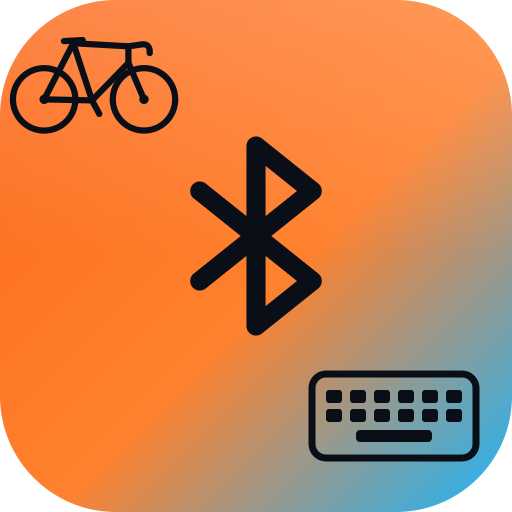
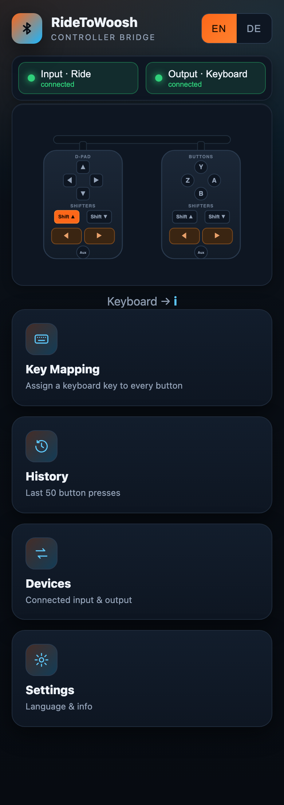
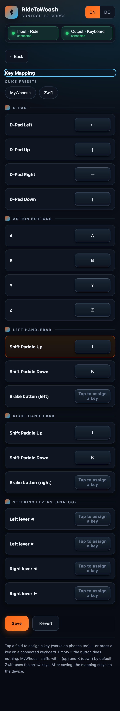
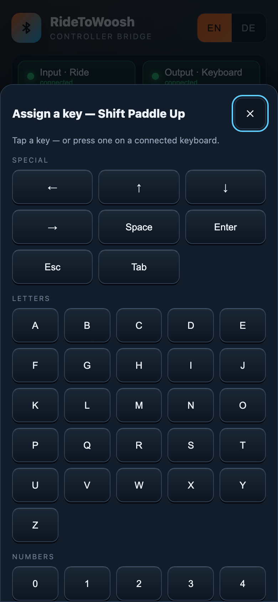
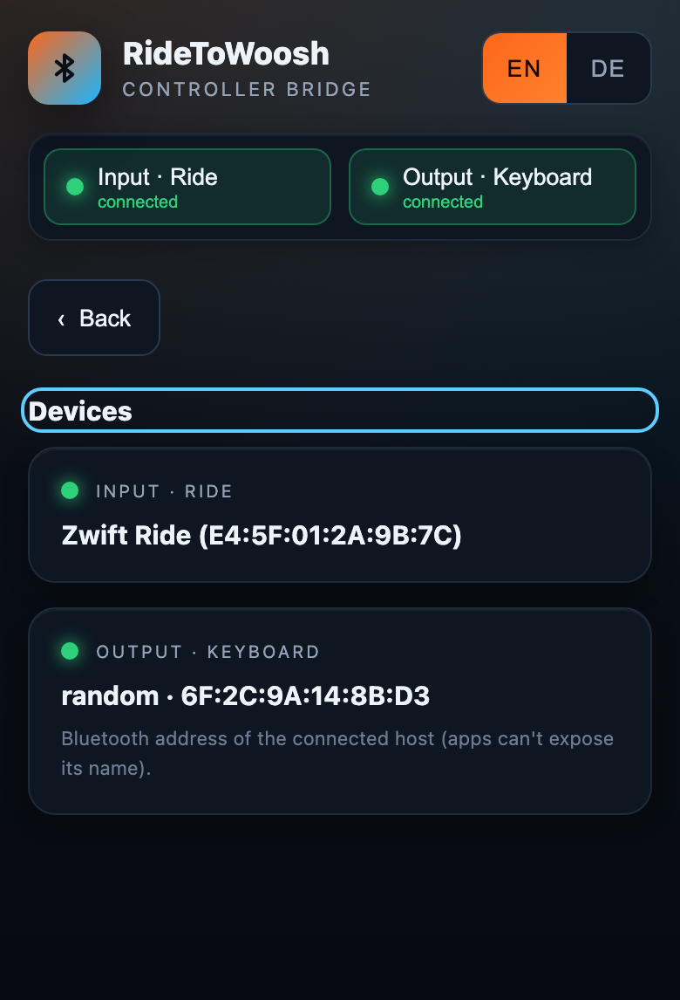

# RideToWooshHID

<p align="center">
  
</p>

<p align="center">
  <a href="LICENSE"></a>
  
  
  
</p>

*Turn your **Zwift Ride** handlebar controller into a freely configurable Bluetooth
keyboard — for MyWhoosh, Zwift, Rouvy and anything else that takes a keyboard, on
PC, Mac, iPad or Apple TV. No subscription, no PC helper script.*

> Personal hobby project. Provided as-is, with no warranties or support guarantees.

> **Not affiliated with, endorsed by, or connected to Zwift or MyWhoosh.** "Zwift
> Ride" and "MyWhoosh" are named only descriptively. No brand logos, fonts or assets
> are used.

## Quickstart (TL;DR)

1. **Buy** an ESP32-S3 board with PSRAM (~€10 — see [Hardware](#hardware)). No wiring, no soldering.
2. **Arduino IDE:** install the ESP32 board package + 4 libraries (see [Build & flash](#build--flash-arduino-ide)).
3. Put all files in one folder named `RideToWooshHID/` and **Upload**.
4. On your iPad / PC / Apple TV, **pair `RideToWooshHID`** as a Bluetooth keyboard.
5. **Turn on the Ride** — it connects automatically.
6. Join the Wi-Fi `RideToWooshHID` (password `ridetowoosh`, **stand close** — see [security](#wi-fi-security)), open `http://192.168.4.1`, map your keys, **Save**.

## What is it for?

The Zwift Ride controller speaks a proprietary Bluetooth protocol that only a few
apps understand. RideToWooshHID reads its buttons and re-emits them as ordinary
keystrokes, so **any** training app with keyboard shortcuts can use the shifters,
D-pad and buttons — fully remappable.

**Why this**

- No subscription, no companion PC app, nothing running in the background.
- Works **wireless end-to-end**, including **Apple TV** where a USB keyboard is awkward.
- Fully **remappable** with one-tap **MyWhoosh / Zwift presets**, configured from any phone.
- Standalone: the mapping lives on the device, not in a cloud account.

## Hardware

- **Board:** any **ESP32-S3 dev board with PSRAM**. A known-good pick is an
  **ESP32-S3-DevKitC-1 (N16R8)** — 16 MB flash, 8 MB **OPI** PSRAM. Cheaper N8R2
  variants and most "ESP32-S3 DevKitC" clones also work; just match the PSRAM type
  in the Tools menu (**OPI** for R8, **QSPI** for R2 — check your board's listing).
- **No wiring or soldering.** It's a USB-powered BLE bridge — there is nothing to
  connect to the GPIOs. Power it from any USB port or a USB power bank on the bike.
- **Cost:** roughly **€8–15** for the board + a USB-C cable. That's the whole BOM.
- A plain ESP32 (not -S3) is **not** recommended — the dual BLE role + WiFi AP needs
  the S3's headroom and PSRAM.

> **Protocol-fragility note (read before buying):** the button decoding relies on the
> Zwift Ride's current BLE protocol. A future Ride firmware update (pushed via the
> Zwift app) could change it and break decoding. Keeping the Ride away from the Zwift
> app avoids both the connection conflict and such updates.

### Compatibility

`✓` confirmed · `~` expected to work (reports welcome) · default mapping shown.

| App | Default shifting | Status |
|---|---|---|
| MyWhoosh | `I` / `K` | ✓ |
| Zwift | arrow keys (preset) | ~ |
| Rouvy | remap as needed | ~ |

| End device | Pairs as BLE keyboard? |
|---|---|
| Windows / macOS | ~ |
| iPad / iPhone (iPadOS/iOS) | ~ |
| Apple TV (tvOS) | ~ |
| Android | ~ |

## Build & flash (Arduino IDE)

**Board package:** install *"esp32 by Espressif"* via the Boards Manager (**core 3.x**
recommended).

**Libraries:**

| Library | Source / fork | Version | Install |
|---|---|---|---|
| NimBLE-Arduino | h2zero | **≥ 2.1.0** | Library Manager |
| ESPAsyncWebServer | **ESP32Async** | latest tested | Library Manager |
| AsyncTCP | **ESP32Async** | latest tested | Library Manager |
| ESP32-NIMBLE-Keyboard | Berg0162 | NimBLE-2.x build | **ZIP** → *Sketch → Include Library → Add .ZIP Library* |

> Pin the versions that compile for you. The `ESPAsyncWebServer`/`AsyncTCP` ecosystem
> is fork-fragmented — use the **ESP32Async** fork, not older T-vK/me-no-dev ones.
> Only **one** BLE-keyboard library may be included and it must use NimBLE, otherwise
> it collides with `NimBLE-Arduino`. The older `T-vK/ESP32-BLE-Keyboard` is **not**
> NimBLE-2.x compatible.

**Board settings** (Tools menu):

- Board: **ESP32S3 Dev Module**
- PSRAM: **OPI PSRAM** (or **QSPI** — match your board)
- Partition Scheme: **any** — the bundled `partitions.csv` overrides it automatically
- USB CDC On Boot: **Enabled** (Serial Monitor over USB)

**Flash:**

1. Put all files in **one** folder named exactly like the sketch: `RideToWooshHID/`.
   (Arduino does not compile files in nested sub-folders.)
2. Connect the S3 over USB, pick the port, **Upload**.
3. Open the Serial Monitor (115200 baud). You should see (log messages are in German):

   ```text
   === RideToWooshHID 1.0.0 startet ===
   [HID] Tastatur-Advertising aktiv ...
   [BLE] Scanne nach 'Zwift Ride'...
   [WiFi] AP 'RideToWooshHID' (TX gedrosselt) — http://192.168.4.1
   ```

### PlatformIO (alternative to the Arduino IDE)

A `platformio.ini` is included and works on the flat layout (no `src/` move needed).
It pins the libraries and uses the bundled `partitions.csv` automatically:

```bash
pio run            # build
pio run -t upload  # flash (auto-detects the port)
pio device monitor # serial @115200
```

The config targets an `esp32-s3-devkitc-1` without PSRAM (boots on any S3). To use a
board's PSRAM, see the commented `BOARD_HAS_PSRAM` / `memory_type` lines in
`platformio.ini`.

## Usage

> **Recommended order:** first verify the mapping (open only the web UI, press the
> Ride, watch the right buttons light up), **then** pair the keyboard to your end
> device. That way you confirm decoding before anything types.

1. **Pair the keyboard:** on your end device, open Bluetooth settings and pair
   `RideToWooshHID` like any keyboard. Once — it reconnects automatically.
2. **Turn on the Ride:** the ESP finds it, performs the `RideOn` handshake and
   subscribes to the buttons. Serial: `[BLE] Ride aktiv`.
3. **Configure:** join the Wi-Fi `RideToWooshHID` (password `ridetowoosh`) and open
   `http://192.168.4.1`.

### Web interface

Tile-based navigation (no hamburger menus), bilingual **EN / DE**:

- **Dashboard** — a live map of the Zwift Ride cockpit: whatever you press lights up
  (D-pad, A/B/Y/Z, shift paddles, orange brake/steer levers + aux), plus the key it
  sends and connection status. Before everything is connected it shows a short
  **get-started checklist**.
- **Key Mapping** — tap a button's key-cap to assign a key from an on-screen
  **picker** (works on phones with no keyboard), or press a key on a connected
  keyboard. One-tap **presets** for MyWhoosh / Zwift, duplicate-key warnings, and an
  **unsaved-changes** indicator; **Save** writes it permanently to the device.
- **History** — a rolling log of the last 50 button presses (time · button → key).
- **Devices** — connected input (Ride, name + address) and output (host address).
- **Settings** — language switch (stored only in your browser) and project info.

> Headless check: `GET http://192.168.4.1/status` returns JSON (firmware,
> connection state, device addresses, IP, uptime, free heap).

## Screenshots

<p align="center">
  
  
  
  
</p>

*Home (live controller map) · key mapping · on-screen key picker · devices — bilingual (EN/DE), shown in English.*

## Storage & stability

The persistent key mapping lives in its **own dedicated NVS partition (`cfg`)**,
separated from the system NVS where the BLE stack writes bonding keys and Wi-Fi
stores PHY calibration. This isolation prevents write races and means a full or
fragmented system NVS can never corrupt your mapping. If `partitions.csv` is not
flashed, the firmware falls back cleanly to the default NVS. In-RAM state is
mutex-guarded; the mapping is committed to flash only on **Save**.

## Wi-Fi security

The config AP serves a local page (key remapping) only, holds no personal data, and
never touches the internet. Two deliberate choices form the threat model:

- **Shared, public password (`ridetowoosh`).** It's in this repo, so it's not a
  secret — it only satisfies WPA2's requirement for a key. For a private link, set
  your own `AP_PASS` in the sketch before flashing (8–63 ASCII chars).
- **Reduced TX power.** The AP runs at low power so it's only visible within ~10–15 m
  (environment-dependent) — **proximity is the actual access control**. If you can't
  see the Wi-Fi, stand next to the bike; to extend range, raise `AP_TX_POWER`. This
  affects WiFi only, not the BLE link to the Ride or your end device.

The web UI is plain HTTP on purpose — acceptable for a local, data-free config AP.
A WPA2/WPA3-transition variant is prepared (commented) in `setup()` for Arduino core 3.x.

## Protocol notes

Button mapping is based on the public reverse-engineering work of **MAKINOLO**
(proto2, message ID `0x23`):

- **Inverted logic:** the Ride reports a pressed button as bit **0**, not 1. The
  firmware inverts this (`~raw & allBits`). If every button shows as permanently
  pressed and *clears* on press, flip `~raw` to `raw` in `onRideNotify()`.
- **Characteristic selection:** the Ride's UUIDs are proprietary; the firmware
  auto-picks the first **notify** characteristic for button data and the first
  **write** one for the `RideOn` handshake — see `findZwiftChars()`.

## Troubleshooting

### Intermittent Bluetooth Disconnects

The serial monitor (`pio device monitor -b 115200`) now distinguishes the two
Bluetooth links and whole-device resets:

- `[PC] disconnected` includes the HID connection's numeric disconnect reason
  in decimal and hex. PC connection parameters and security state are also logged.
- `[Ride] disconnected` refers to the controller, not the PC.
- `[Boot] reset_reason=...` indicates a boot and reports the ESP-IDF reset reason.
  A new boot message during a dropout suggests a device reset rather than only
  a lost Bluetooth link.
- `[Health]` reports uptime, current/minimum free heap, and both link states once
  per minute. Capture these lines before and after a failure.

Ride discovery uses finite three-second scans with callback-only results. Failed
scan starts and connection setup are retried with a two-second backoff; connection
attempts use a five-second stack timeout (not a deadline for all GATT setup).
The bridge only marks the Ride ready after handshake and subscription succeed.
PC advertising/reconnection remains managed by the keyboard library and PC.

After flashing, check PC Bluetooth off/on and sleep/wake, switch the Ride off
during setup and while holding a button, and repeat reconnects while using the web
interface. Verify that buttons work again, stale highlights clear, and free heap
does not continually decline. A firmware build alone cannot validate RF stability
or Windows power-management behavior. Include the serial log with any remaining
disconnect report. PlatformIO dependencies are pinned in `platformio.ini` so
repeated builds use the same library versions.

| Symptom | Likely cause | Fix |
|---|---|---|
| Can't see the `RideToWooshHID` Wi-Fi | TX power is intentionally low | Stand next to the bike; or raise `AP_TX_POWER` |
| "Ride connected" never lights | Ride still bonded to the Zwift app | Close Zwift / disconnect BT there so the Ride is free |
| Connected, but no buttons arrive | Wrong notify characteristic (firmware variant) | Dump characteristics on serial, pick the right one in `findZwiftChars()` |
| All buttons show permanently pressed | Inverted-logic variant | Change `~raw` to `raw` in `onRideNotify()` |
| Keyboard types twice | `write()` press+release vs app expecting hold | Switch to `press()`/`release()` edge logic |
| Won't boot / crashes | Wrong PSRAM setting or 2nd BLE lib compiled in | Match OPI/QSPI; ensure no Bluedroid BLE lib |
| Mapping lost after reboot | `cfg` partition missing, or you didn't Save | Flash with `partitions.csv` present; press **Save** |

## Files

- `RideToWooshHID.ino` — firmware (BLE-Central + HID + web server / WebSocket)
- `webui.h` — embedded web interface (tiles, live view, mapping, key picker, history, devices)
- `i18n.h` — language files (`/i18n/en.json` default + `/i18n/de.json`), served from PROGMEM
- `partitions.csv` — partition layout with the dedicated `cfg` NVS partition
- `images/` — logo, social preview, UI screenshots

## Contributing

Issues and PRs welcome — see [CONTRIBUTING.md](CONTRIBUTING.md) (how to add a UI
language, add a key token, and what to include in a bug report). Adding a language is
just a new block in `i18n.h` + a button in `webui.h`.

## License

GNU General Public License v3.0 — see [LICENSE](LICENSE). Open source, and it must
stay open source: derivatives must remain under the GPL.

## Acknowledgements

Built on the open-source community that reverse-engineered the Zwift Ride / Zwift Play
BLE protocol:

- **MAKINOLO** — public reverse engineering (proto2, message ID `0x23`) the entire
  button mapping is based on.
- The wider **Zwift Play/Ride reverse-engineering projects** that documented the
  bindings, characteristics and button bits.
- **Berg0162** — the NimBLE-2.x-compatible `ESP32-NIMBLE-Keyboard` library.

If your project helped and isn't listed, please open an issue — credit gladly added.

## On LLM use

Built human-in-the-loop with an LLM: the idea and every design decision are human,
the implementation is largely model-written from targeted, well-scoped prompts.

---

[](https://ko-fi.com/lordvonbaum)

> Donations are voluntary and solely support the project. They do not influence the
> prioritisation of bugs, feature requests or support enquiries.
